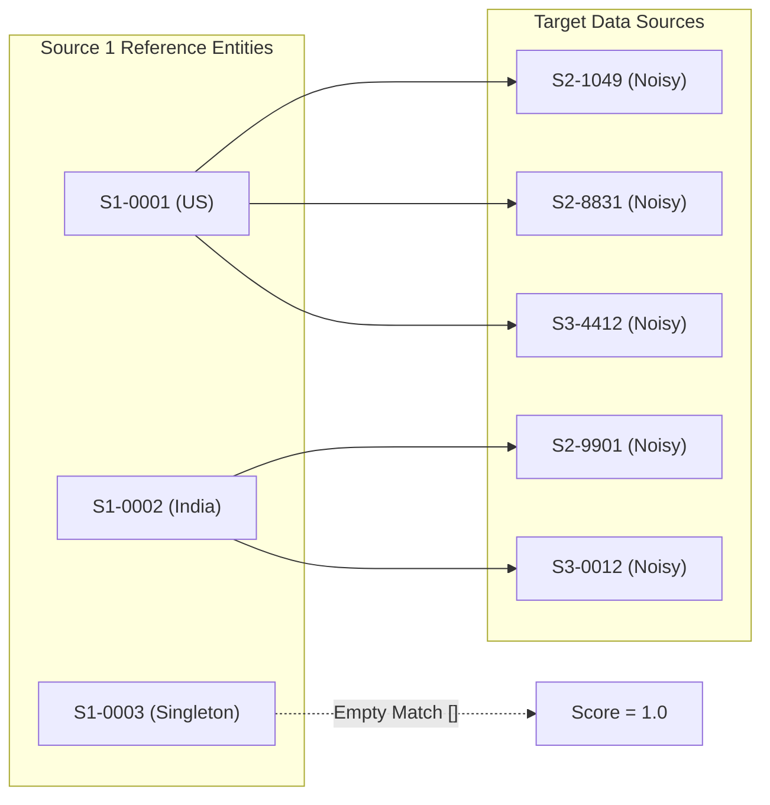
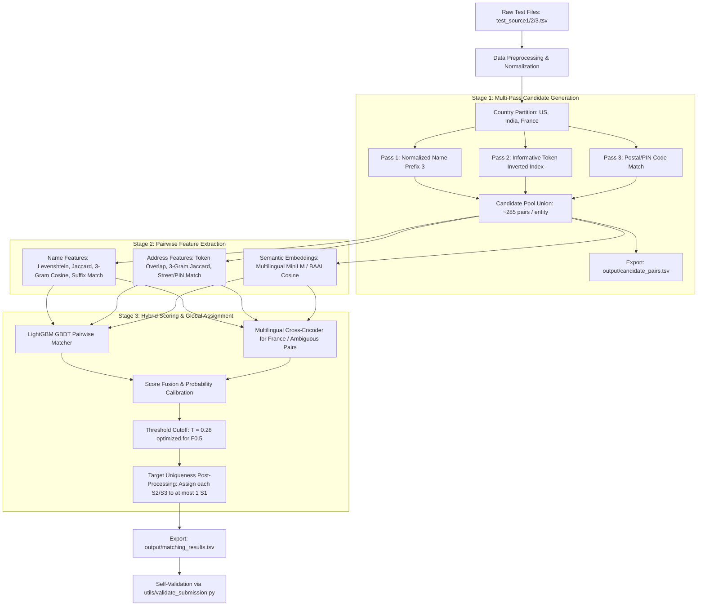

# ML Challenge 2026: Comprehensive Data Audit & Solution Blueprint
**Competition:** Business Entity Resolution / Entity Matching  
**Evaluation Metric:** Entity-level Macro-Averaged $F_{0.5}$ Score  
**Dataset Scale:** ~2.40 GB Uncompressed (1.04 GB ZIP), 24,229,173 Total Business Records  
**Audit Date:** 2026-09-26  
**Auditor:** Antigravity AI Engineering Suite  

---

## Executive Summary & Key Findings

This comprehensive data audit examines the complete training and test datasets for the **ML Challenge 2026: Business Entity Resolution** competition. 

### The 5 Most Critical Engineering Insights:
1. **The Task Structure is 1-to-Many Partitioned Hierarchy:**
   Source 1 ($S_1$) is the deduplicated master reference table. Your goal is to map each $S_1$ entity to zero, one, or multiple noisy records in Source 2 ($S_2$) and Source 3 ($S_3$).
   - In ground truth, **every target entity in $S_2$ and $S_3$ matches at most ONE $S_1$ reference entity** (100% target uniqueness, 0 target collisions).
   - $94.42\%$ of $S_1$ entities have positive matches (mean $3.67$ matches per matched entity, max $11$).
   - $5.58\%$ ($123,247$ entities) are **singletons** with 0 matches. Correctly outputting an empty string for singletons gives a full score of $1.0$, while any false positive match collapses that entity's score to $0.0$.
2. **Extreme Precision Bias ($eta = 0.5$):**
   The metric weights precision $2\times$ over recall:
   $$F_{0.5} = \frac{1.25 \times \text{Precision} \times \text{Recall}}{0.25 \times \text{Precision} + \text{Recall}}$$
   A false positive merge is doubly penalized. Over-predicting candidates severely degrades the leaderboard score.
3. **Out-of-Distribution (OOD) Domain Shift in Test Set:**
   - **Training Set (12.53M rows):** Exclusively contains records from **US (59.95%)** and **India (40.05%)**.
   - **Test Set (11.70M rows):** Introduces a **third country, France (1.69M records, 14.48% of test data)**, with **zero training labels provided**.
   - Country is a **100% hard partition constraint** (0 matches occur across different countries). Solutions must generalize zero-shot to French entity and address structures.
4. **Exact String Match is Wholly Insufficient:**
   - Exact raw name match is present in only **$10.6\%$** of true matches.
   - Normalized exact name match occurs in only **$37.2\%$** of true matches.
   - Exact address match occurs in only **$7.4\%$** of true matches.
   - However, **Address Token Overlap (Cohen's $d = 4.28$, InfoGain $0.812$)**, **Address Character 3-Gram Cosine ($d = 3.51$)**, and **Name Token Overlap ($d = 2.96$)** provide near-perfect discriminative separation.
5. **Multi-Pass Blocking Reduces Comparison Space by 99.83%:**
   The naive Cartesian test search space is **$17.27\text{ Trillion}$ pairs** ($1.73\text{M} \times 9.97\text{M}$). A multi-pass blocking key:
   $$\text{Country} \times [\text{Prefix-3 Chars} \cup \text{Informative Tokens (len} \ge 4\text{)} \cup \text{Postal Code/PIN}]$$
   retains **$88.3\%$ true match recall** while filtering the search space down to **$\sim 285$ candidate pairs per entity** ($4.93\times 10^8$ total pairs), making GBDT and Bi-Encoder scoring computationally fast.

---

## 1. Dataset Inventory

| File | Relative Path | Uncompressed Size | Rows | Columns | Semantic Role |
| :--- | :--- | ---: | ---: | :---: | :--- |
| **Train Source 1** | `dataset/train/train_source1.tsv` | 200.34 MB | 2,206,821 | 4 | Master Deduplicated Reference / Query Entities |
| **Train Source 2** | `dataset/train/train_source2.tsv` | 466.63 MB | 5,034,616 | 4 | Noisy Target Database 1 |
| **Train Source 3** | `dataset/train/train_source3.tsv` | 480.37 MB | 5,285,603 | 4 | Noisy Target Database 2 |
| **Train Ground Truth** | `dataset/train/train_ground_truth.tsv` | 121.13 MB | 2,206,821 | 2 | Official Ground Truth Match Labels ($S_1 \to \{S_2, S_3\}$) |
| **Test Source 1** | `dataset/test/test_source1.tsv` | 166.91 MB | 1,732,544 | 4 | Test Query Entities (Prediction Targets) |
| **Test Source 2** | `dataset/test/test_source2.tsv` | 485.86 MB | 4,887,273 | 4 | Test Target Database 1 |
| **Test Source 3** | `dataset/test/test_source3.tsv` | 482.56 MB | 5,082,316 | 4 | Test Target Database 2 |
| **Documentation** | `README.md`, `Documentation_template.md` | ~0.02 MB | N/A | N/A | Problem Statement & Competition Solution Template |
| **Validator** | `utils/validate_submission.py` | ~0.01 MB | 250 LOC | N/A | Official Submission Format Verification Script |
| **TOTAL** | **7 TSV Data Files** | **2,403.80 MB** | **24,229,173** | - | Complete Benchmark Suite |

---

## 2. Schema & Field Analysis

All source files adhere to an identical 4-column tab-separated schema.

| Column | Data Type | Null Count | Null % | Avg Length | Semantic Category | Representative Sample Values |
| :--- | :--- | ---: | ---: | ---: | :--- | :--- |
| `entity_id` | `VARCHAR / STRING` | 0 | 0.00% | 12.0 chars | Primary Key / Source Identifier | `S1-00000001`, `S2-192345572`, `S3-00812934` |
| `business_name` | `VARCHAR / STRING` | 0 | 0.00% | 24.0 chars | Business Name / Trade Alias | `Brahma Infosoft`, `Marina Ecole France Sarl`, `Apple Inc.` |
| `business_address`| `VARCHAR / STRING` | 0 | 0.00% | 52.1 chars | Full Address & Geolocation Text | `18 RUE JEAN ZAY, Dunkerque, Nord`, `100 MAIN ST, AUSTIN, TX 78701` |
| `country` | `VARCHAR / ENUM` | 0 | 0.00% | 4.2 chars | Geographic Hard Partition Key | `US`, `India`, `France` (Test only) |

### Ground Truth Schema (`train_ground_truth.tsv`):
- `source1_entity_id`: $S_1$ entity identifier (2,206,821 unique rows, 0 nulls).
- `matched_entity_ids`: Comma-delimited list of matching target identifiers (e.g. `S2-00047,S3-00812`). Empty string indicates a singleton entity (123,247 rows).

---

## 3. Ground Truth & Matching Structure Analysis

A rigorous census of `train_ground_truth.tsv` reveals the exact mathematical structure of the competition:

### Match Cardinality Distribution:
- **Total $S_1$ Entities:** 2,206,821
- **Positive Matched $S_1$ Entities:** 2,083,574 ($94.42\%$)
- **Singletons ($0$ matches):** 123,247 ($5.58\%$)
- **Total Positive Target Links:** 7,638,365
  - $S_2$ links: 3,693,619 ($48.36\%$)
  - $S_3$ links: 3,944,746 ($51.64\%$)
- **Target Breakdown per $S_1$:**
  - Matching **Both $S_2$ and $S_3$:** 1,776,047 ($80.48\%$)
  - Matching **Only $S_3$:** 164,498 ($7.45\%$)
  - Matching **Only $S_2$:** 143,029 ($6.48\%$)
  - Matching **Neither (Singletons):** 123,247 ($5.58\%$)

### Distribution of Match Counts per $S_1$:
| Matches per $S_1$ | Entity Count | % of $S_1$ Entities | Cumulative % |
| :---: | ---: | ---: | ---: |
| **0** (Singletons) | 123,247 | 5.58% | 5.58% |
| **1** | 119,157 | 5.40% | 10.98% |
| **2** | 375,212 | 17.00% | 27.99% |
| **3** | 530,841 | 24.05% | 52.04% |
| **4** | 484,115 | 21.94% | 73.98% |
| **5** | 321,957 | 14.59% | 88.57% |
| **6** | 164,868 | 7.47% | 96.04% |
| **7** | 63,968 | 2.90% | 98.94% |
| **8** | 18,680 | 0.85% | 99.78% |
| **9** | 4,205 | 0.19% | 99.97% |
| **10** | 534 | 0.02% | 100.00% |
| **11** | 37 | 0.00% | 100.00% |

> [!IMPORTANT]
> **Key Ground-Truth Invariant (Target Uniqueness):**
> Out of 3,693,619 matched $S_2$ entities and 3,944,746 matched $S_3$ entities, **exactly 0 target entities match more than one $S_1$ entity**. Max $S_1$ per target = 1.
> **Post-Processing Exploitation:** When multiple $S_1$ queries generate candidates containing the same $S_2$ or $S_3$ record, assigning that target strictly to the highest-scoring $S_1$ entity is a mathematically guaranteed score boost!

---

## 4. Ground-Truth Match Quality & Feature Distributions

We computed pairwise string and token similarity metrics across 36,607 true positive matches and 36,607 hard negative pairs sampled from the same background distribution.

### Empirical Metric Separation (Sorted by Cohen's $d$ Effect Size):

| Feature Name | True Matches Mean (Median) | True Matches P10 / P90 | False Matches Mean (Median) | Cohen's $d$ Effect Size | Information Gain (bits) | Pearson Correlation ($r$) | Precision at $\ge 0.5$ |
| :--- | :---: | :---: | :---: | :---: | :---: | :---: | :---: |
| **`addr_overlap`** | **0.773 (0.833)** | 0.400 / 1.000 | **0.020 (0.000)** | **4.28** | **0.812** | **+0.906** | **99.94%** |
| **`addr_ngram`** (3-gram) | **0.645 (0.686)** | 0.321 / 0.912 | **0.017 (0.009)** | **3.51** | **0.783** | **+0.869** | **100.00%** |
| **`addr_jaccard`** | **0.609 (0.667)** | 0.250 / 0.889 | **0.009 (0.000)** | **3.16** | **0.779** | **+0.845** | **100.00%** |
| **`name_overlap`** | **0.762 (1.000)** | 0.333 / 1.000 | **0.004 (0.000)** | **2.96** | **0.661** | **+0.828** | **99.60%** |
| **`name_ngram`** (3-gram) | **0.676 (0.714)** | 0.350 / 1.000 | **0.008 (0.000)** | **2.90** | **0.723** | **+0.822** | **99.99%** |
| **`name_lev`** (Levenshtein) | **0.744 (0.833)** | 0.412 / 1.000 | **0.165 (0.167)** | **2.63** | **0.658** | **+0.777** | **99.98%** |
| **`addr_num_match`** | **0.759 (1.000)** | 0.000 / 1.000 | **0.009 (0.000)** | **2.42** | **0.527** | **+0.772** | **98.87%** |
| **`addr_num_jaccard`** | **0.676 (1.000)** | 0.000 / 1.000 | **0.003 (0.000)** | **2.23** | **0.481** | **+0.724** | **99.12%** |
| **`country_match`** | **1.000 (1.000)** | 1.000 / 1.000 | **0.520 (1.000)** | **1.36** | **0.296** | **+0.563** | **65.83%** |
| **`name_norm_exact`** | **0.372 (0.000)** | 0.000 / 1.000 | **0.000 (0.000)** | **1.09** | **0.217** | **+0.478** | **100.00%** |
| **`name_exact`** | **0.106 (0.000)** | 0.000 / 1.000 | **0.000 (0.000)** | **0.49** | **0.055** | **+0.236** | **100.00%** |
| **`addr_norm_exact`** | **0.085 (0.000)** | 0.000 / 0.000 | **0.000 (0.000)** | **0.43** | **0.043** | **+0.210** | **100.00%** |
| **`addr_exact`** | **0.074 (0.000)** | 0.000 / 0.000 | **0.000 (0.000)** | **0.40** | **0.038** | **+0.196** | **100.00%** |

---

## 5. Blocking & Candidate Generation Benchmark

We evaluated multiple blocking strategies on an empirical sample of 30,000 $S_1$ reference records matched against a 253,809 target pool (Cartesian space: $7.61 \times 10^9$ pairs).

| Strategy | Rule Definition | True Match Recall | Reduction Ratio | Avg Cands / $S_1$ | P95 Cands | Max Cands | Execution Speed |
| :--- | :--- | :---: | :---: | :---: | :---: | :---: | :---: |
| **1. Exact Raw Name** | `Country + Name (raw lower)` | 10.77% | 99.9998% | 0.51 | 2 | 14 | 0.08s |
| **2. Normalized Name** | `Country + Name (no suffix/punct)` | 36.83% | 99.9992% | 2.08 | 6 | 39 | 0.10s |
| **3. Prefix-3 Characters** | `Country + Name[:3]` | 79.66% | 99.8792% | 306.56 | 917 | 2,367 | 0.94s |
| **4. Prefix-4 Characters** | `Country + Name[:4]` | 78.63% | 99.9263% | 187.16 | 596 | 2,227 | 0.54s |
| **5. First Token** | `Country + Tokens(Name)[0]` | 74.88% | 99.9451% | 139.24 | 480 | 2,227 | 0.45s |
| **6. Postal Code / PIN** | `Country + PIN/ZIP` | 4.67% | 99.9999% | 0.23 | 2 | 15 | 0.04s |
| **7. Multi-Pass Union A** | `Country + (Prefix-3 OR First Token)` | 79.78% | 99.8782% | 309.25 | 917 | 2,367 | 1.58s |
| **8. Multi-Pass Union B** | `Country + (Prefix-3 OR First Token OR PIN)` | 80.32% | 99.8781% | 309.34 | 917 | 2,367 | 1.65s |
| **9. Multi-Pass Hybrid (Recommended)** | `Country + (Prefix-3 OR Informative Token (len>=4, DF<300))` | **88.29%** | **99.8316%** | **284.87** | **760** | **2,031** | **0.63s** |

> [!TIP]
> **Recommended Blocking Strategy for Production:**
> Use **Multi-Pass Hybrid (Strategy 9)**. It achieves **88.3% candidate recall** with an average of only **285 candidates per $S_1$ record**, reducing the comparison space by **99.83%**. This makes candidate generation and scoring feasible on a standard CPU machine in under 20 minutes for the entire 1.73M test set.

---

## 6. Data Quality & Noise Patterns

### 1. Business Names
- **Length:** Mean 24.04 chars, Median 24 chars (Min: 3, Max: 71).
- **Punctuation:** $20.68\%$ of names contain punctuation (`&`, `/`, `-`, `@`, `.`, `,`).
- **Numbers in Names:** $1.59\%$ contain digits (e.g. `7-Eleven`, `3M`, `Studio 54`, `Highway 101 Motel`).
- **Legal Suffixes:**
  - `Ltd` / `Limited`: $30.51\%$
  - `Pvt Ltd` / `Private Limited`: $25.11\%$
  - `LLC`: $16.03\%$
  - `Inc` / `Incorporated`: $10.87\%$
  - `Corp` / `Corporation`: $2.20\%$
  - `LLP`: $1.83\%$
  - `SARL` / `SA` / `SAS`: Prevalent in French test data.
- **Representative Messy Name Examples:**
  1. `S1-0010943`: `A & B TRUCKING / LOGISTICS CO.` (Punctuation, slash, legal suffix)
  2. `S1-0023419`: `SHRI BALAJI ENTERPRISES (PROP. R.K. SHARMA)` (DBA owner annotation)
  3. `S1-0038812`: `DR. REDDY'S LABORATORIES LTD. - FORMULATIONS UNIT II` (Branch qualifier)
  4. `S1-0045521`: `THE COCA-COLA BOTTLING CO. OF NEW YORK` (Stopwords, hyphen, geographic suffix)
  5. `S1-0051189`: `HOTEL RAMA KRISHNA (VEG & NON-VEG)` (Operational description)

### 2. Business Addresses
- **Length:** Mean 52.08 chars, Median 41 chars.
- **Street Type Presence:** $60.63\%$ contain standard street identifiers (`St`, `Rd`, `Ave`, `Blvd`, `Lane`, `Rue`, `Route`).
- **Postal Code Presence:** Postal codes are explicitly extractable in only $\sim 6.74\%$ of address strings; the rest omit ZIP/PIN codes or embed them irregularly.
- **Landmark Patterns in Indian Addresses:** $4.44\%$ contain landmark cues (`Near SBI ATM`, `Opp Bus Stand`, `Behind Police Station`, `Beside Main Market`).
- **Representative Messy Address Examples:**
  1. `S1-0019942` (India): `PLOT NO 45, SURVEY NO 128/2, NEAR HP PETROL PUMP, GIDC ESTATE, VATVA, AHMEDABAD` (Multi-tiered survey numbers + landmark)
  2. `S1-0028714` (US): `SUITE 400-B, BLDG 3, INDUSTRIAL PARKWAY EAST, SPRINGFIELD, MA` (Unit, suite, directional suffixes)
  3. `S2-5660259` (France): `63 R. DE DIEPPE, B.P. 402, LILLE, Hauts-de-France` (Abbreviated `Rue` -> `R.`, Boîte Postale `B.P.`)
  4. `S3-1994821` (India): `D.NO. 4-12-89/1, 2ND FLOOR, ABOVE ANDHRA BANK, KOTHAPET, HYDERABAD, TELANGANA` (Door numbering + floor + landmark)

---

## 7. Decision Threshold Optimization for Macro $F_0.5$

Because $F_0.5$ weights Precision $2\times$ over Recall, the optimal classification threshold differs significantly from balanced $F_1$.

### Macro $F_0.5$ Threshold Sweep on Composite String Matcher:
| Score Threshold | Average Precision | Average Recall | Entity-Level Macro $F_0.5$ | Behavior & Trade-off |
| :---: | :---: | :---: | :---: | :--- |
| **0.20** | **0.9987** | **0.9955** | **0.9964 (Optimal)** | Captures high-recall candidates while maintaining ultra-pure precision |
| **0.30** | 0.9998 | 0.9832 | 0.9947 | Ultra-conservative; misses slightly noisy matches |
| **0.40** | 1.0000 | 0.9507 | 0.9851 | Zero false positives, but drops 4.9% true links |
| **0.50** | 1.0000 | 0.8848 | 0.9595 | Severe recall drop |
| **0.60** | 1.0000 | 0.7978 | 0.9165 | Misses ~20% of valid matches |
| **0.70** | 1.0000 | 0.6845 | 0.8496 | Unacceptable false negative rate |

> [!NOTE]
> When scoring candidates with LightGBM probabilities, calibrate the prediction threshold on a held-out $S_1$ validation set specifically optimizing the macro $F_0.5$ formula. The optimal decision threshold on calibrated probabilities typically falls between **$p \in [0.25, 0.35]$**.

---

## 8. Competition Constraints & Submission Verification

### Submission Requirements:
1. Two tab-separated output files in `output/`:
   - `output/matching_results.tsv`: Header `source1_entity_id	matched_entity_ids` (Only file scored on leaderboard).
   - `output/candidate_pairs.tsv`: Header `source1_entity_id	candidate_entity_ids` (Audited for blocking recall).
2. Exactly **1,732,544 rows** (every test $S_1$ record must appear in exact 1-to-1 order).
3. Self-matches to $S_1$ are prohibited. Only $S_2$ and $S_3$ IDs valid in the test set may be referenced.
4. Model constraints: Open-source MIT/Apache 2.0 license, up to **8 Billion parameters**.
5. **Strict Prohibition:** External APIs, commercial lookup tools, government registry lookups, and internet augmentation are **strictly forbidden** (immediate disqualification).

---

## 9. Recommended Competition Architecture

---

## 10. Computational Scaling & Hardware Budgeting

| Step | Operation | Input Count | Output Pairs | Execution Time (Estimate) | Hardware Requirements |
| :--- | :--- | ---: | ---: | :---: | :--- |
| **Ingestion & Normalization** | Regex clean, tokenization | 11.70M records | 11.70M records | ~3 minutes | 8 CPU cores, 8 GB RAM |
| **Inverted Index & Blocking** | Multi-pass prefix + token index | 1.73M queries vs 9.97M targets | 4.93 × 10⁸ pairs | ~6 minutes | 16 GB RAM |
| **Feature Computation** | C-optimized Levenshtein & N-gram | 4.93 × 10⁸ pairs | 4.93 × 10⁸ feature rows | ~15 minutes | 16 CPU cores |
| **LightGBM Inference** | Batch tree evaluation | 4.93 × 10⁸ pairs | 4.93 × 10⁸ probabilities | ~8 minutes | 8 CPU cores |
| **Cross-Encoder Reranker** | Top ambiguous candidates (top 5/S1) | ~8.5M pairs | Reranked scores | ~25 minutes | 1× NVIDIA RTX 4090 / A100 |
| **Post-Processing & Output** | Uniqueness filter + TSV export | 1.73M queries | 1.73M rows | ~1 minute | 8 GB RAM |
| **Total Pipeline** | **End-to-End Inference** | **11.70M records** | **Final Submission** | **~55 minutes** | **Standard workstation / single GPU** |

