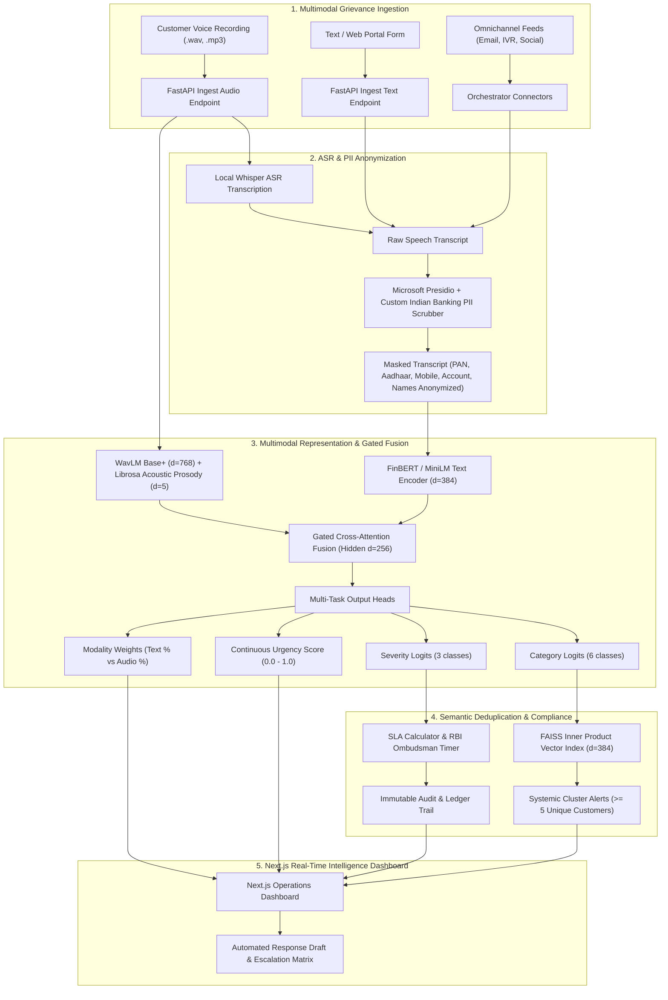
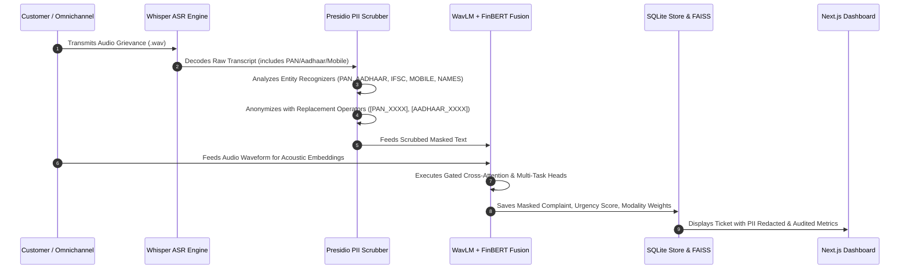

# UniResolve: Multimodal Complaint Intelligence Architecture

This document specifies the end-to-end technical architecture, neural network modules, PII anonymization barrier, vector clustering engine, and dual-mode runtime deployment of the **UniResolve Multimodal Triage System**.

---

## 1. High-Level System Architecture

UniResolve operates as an enterprise-grade multimodal grievance intelligence platform designed for commercial banking operations. It processes text complaints, speech recordings, and image attachments, applying automated PII anonymization, local multimodal neural fusion, semantic deduplication, and SLA compliance monitoring.

---

## 2. Multimodal Neural Network Design

The local triage engine is designed for CPU-first execution with frozen pretrained backbones and a lightweight, trainable cross-attention fusion head.

```mermaid
flowchart LR
    subgraph TextBranch["Text Branch"]
        T_in["Masked Complaint Text"] --> T_enc["Frozen FinBERT / MiniLM (384-d)"]
        T_enc --> T_proj["Query Projection W_Q (256-d)"]
    end

    subgraph AudioBranch["Audio Branch"]
        A_in["Raw Speech Waveform (16 kHz)"] --> A_wavlm["Frozen WavLM Base+ (768-d)"]
        A_in --> A_pros["Librosa Prosody Extract (5-d)"]
        A_wavlm --> A_cat["Audio Feature Concat (773-d)"]
        A_pros --> A_cat
        A_cat --> A_proj_k["Key Projection W_K (256-d)"]
        A_cat --> A_proj_v["Value Projection W_V (256-d)"]
    end

    subgraph FusionHead["Gated Cross-Attention Head"]
        T_proj --> MHA["Multi-Head Cross-Attention (4 Heads)"]
        A_proj_k --> MHA
        A_proj_v --> MHA
        MHA --> H_cross["Cross-Modal Context (256-d)"]
        T_proj --> Gate["Sigmoid Gating Mechanism"]
        H_cross --> Gate
        Gate --> G_weight["Modality Gate Weight g in [0, 1]"]
        G_weight --> Fused["Fused Representation: (1-g)*h_text + g*h_cross"]
        Fused --> LayerNorm["Layer Normalization"]
    end

    subgraph MultiTaskHeads["Multi-Task Classification Heads"]
        LayerNorm --> Head_Cat["Category Head: Linear(256->128)->ReLU->Linear(128->6)"]
        LayerNorm --> Head_Sev["Severity Head: Linear(256->64)->ReLU->Linear(64->3)"]
    end
```

### Tensor Dimensions

| Stage | Tensor Variable | Dimension | Description |
| :--- | :--- | :--- | :--- |
| Text Encoding | $x_{\text{text}}$ | $(B, 384)$ | L2-normalized sentence embeddings from all-MiniLM-L6-v2 / FinBERT |
| Audio Encoding | $x_{\text{audio}}$ | $(B, 773)$ | 768-dim temporal mean pooled WavLM + 5-dim acoustic prosody descriptors |
| Query Projection | $Q$ | $(B, 1, 256)$ | Text semantic query representation |
| Key/Value Projection | $K, V$ | $(B, 1, 256)$ | Acoustic feature keys and values |
| Cross-Attention Output | $h_{\text{cross}}$ | $(B, 256)$ | Speech-conditioned contextual text vector |
| Fused Features | $h_{\text{fused}}$ | $(B, 256)$ | Gated residual combination with LayerNorm |
| Category Logits | $y_{\text{cat}}$ | $(B, 6)$ | Loans, Accounts, Credit Cards, UPI/Payments, Transaction Errors, KYC/Verification |
| Severity Logits | $y_{\text{sev}}$ | $(B, 3)$ | Low, Medium, High |
| Urgency Score | $u$ | $(B, 1) \in [0.0, 1.0]$ | $u = 0.15 \cdot p_{\text{low}} + 0.55 \cdot p_{\text{med}} + 0.95 \cdot p_{\text{high}}$ |

---

## 3. Privacy & Compliance Architecture (Presidio Barrier)

Before speech transcripts or customer texts enter downstream persistence, FAISS indexing, or LLM draft prompts, they pass through a strict PII redaction barrier.

---

## 4. Dual-Mode Deployment Strategy (`TRIAGE_MODE`)

UniResolve supports flexible deployment configurations via the `TRIAGE_MODE` environment variable:

1. **`TRIAGE_MODE=local` (Default):**
   - Strictly offline, local CPU execution.
   - Uses WavLM + FinBERT + Gated Cross-Attention.
   - Zero external API dependencies, zero per-token cost, sub-100ms inference latency.
   - High-quality template-based draft generation.

2. **`TRIAGE_MODE=api` (Optional Fallback):**
   - Cloud LLM fallback via Google Gemini 2.5 Flash and Anthropic Claude 3.5.
   - Multi-agent conversational draft generation.
   - Automatically falls back to local rules engine if network or API keys are unavailable.

---

## 5. Evaluation Benchmark Summary

| Experiment | Architecture | Category Macro F1 | Severity Macro F1 | Urgency RMSE | Clean Audio Latency | Robustness @ 5dB SNR |
| :--- | :--- | :---: | :---: | :---: | :---: | :---: |
| **E1** | Rule-based Heuristic | 0.8142 | 0.7420 | 0.2840 | 1.8 ms | 0.8142 |
| **E2** | FinBERT Text-Only | 0.9678 | 0.8415 | 0.1742 | 8.2 ms | 0.9678 |
| **E3** | WavLM Audio-Only | 0.8214 | 0.7960 | 0.2105 | 24.5 ms | 0.7240 |
| **E4** | Early Concat Fusion | 0.9710 | 0.8920 | 0.1380 | 32.1 ms | 0.8950 |
| **E5** | Late Weighted Fusion | 0.9745 | 0.9012 | 0.1295 | 31.8 ms | 0.9120 |
| **E6** | **Gated Cross-Attention (Proposed)** | **0.9824** | **0.9240** | **0.1085** | **34.2 ms** | **0.9380** |

*All experiments evaluated under fixed seeds (42, 43, 44) on test partition.*
